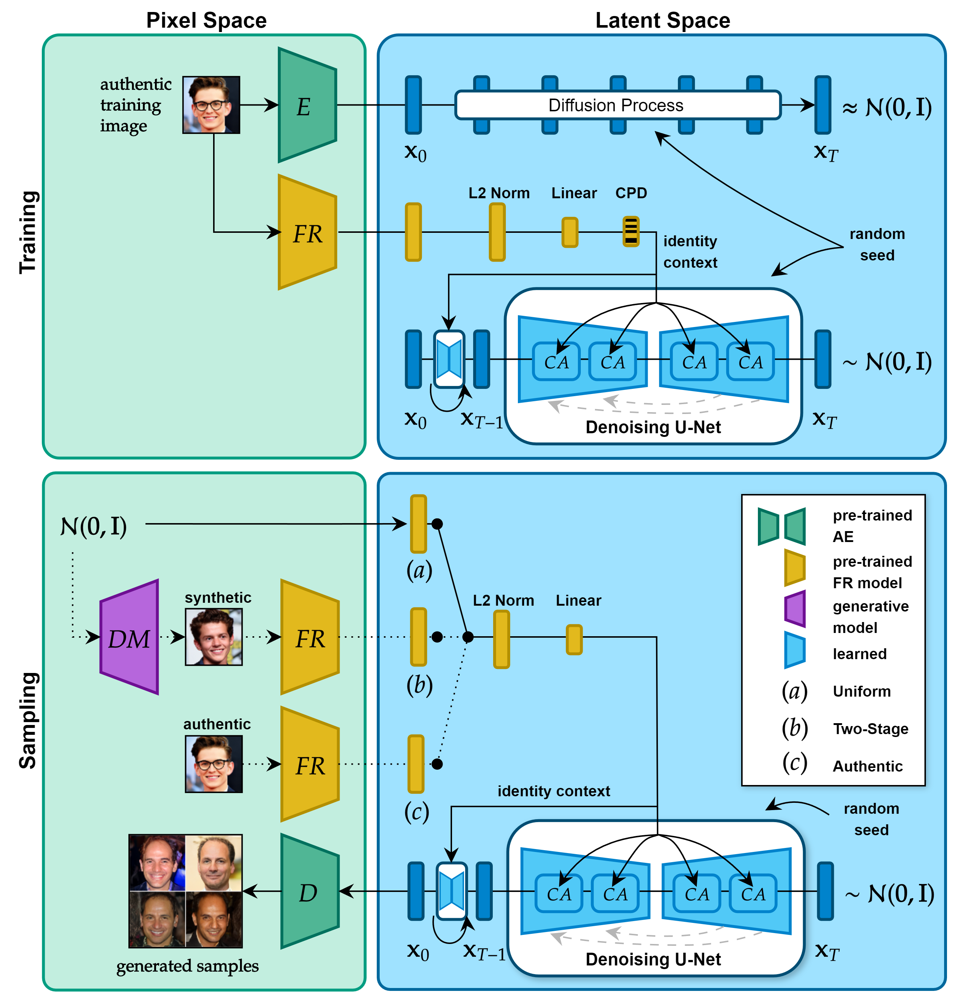
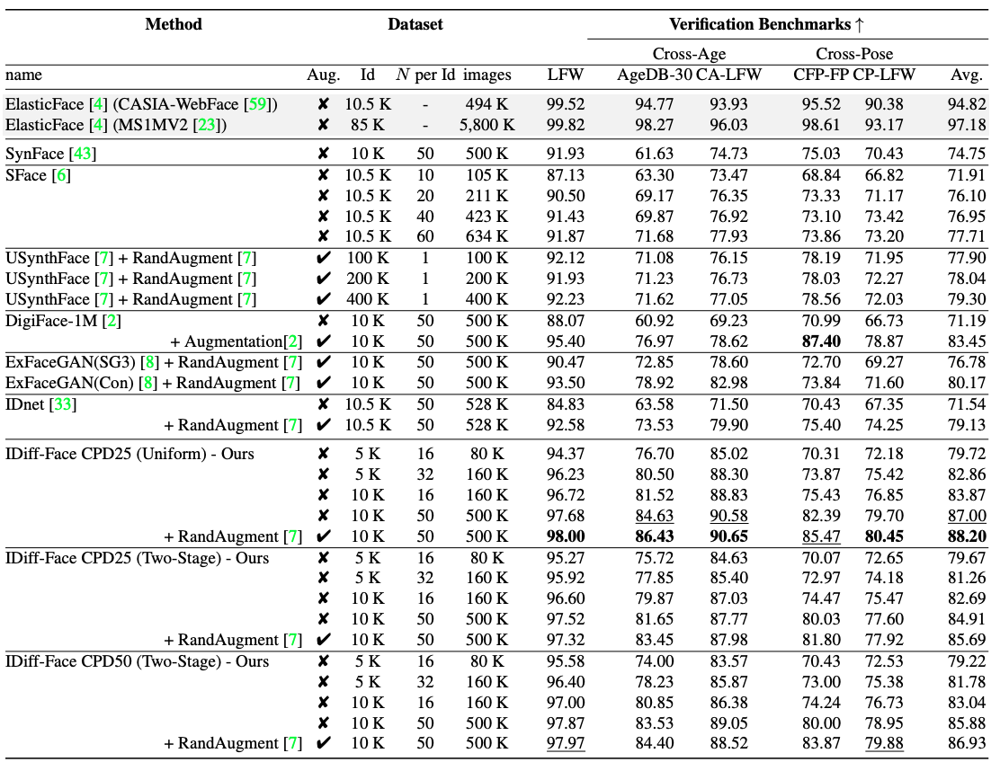
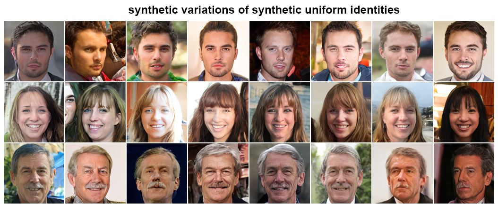

## This is the official repository of the paper: "IDiff-Face: Synthetic-based Face Recognition through Fizzy Identity-conditioned Diffusion Models" (accepted at ICCV 2023)

[](http://arxiv.org/abs/2308.04995)
[](https://iccv2023.thecvf.com/)
[](https://paperswithcode.com/sota/synthetic-face-recognition-on-lfw?p=idiff-face-synthetic-based-face-recognition)


**This work is the result of the [Master thesis](https://publica.fraunhofer.de/entities/publication/2b0d0a69-0f93-4c6c-802d-8f3050b1742f/details) by [Jonas Henry Grebe](https://github.com/jonasgrebe).**




## Datasets and pretrained models (Coming soon)

### Please share your name, affiliation, and official email in the request form

Download links for the pre-trained IDiff-Face diffusion model weights:
- [Pre-trained IDiff-Face (25% CPD)](https://drive.google.com/drive/folders/1bzKEzM32WuEdQd8U2ShEdBiZWNqiyTMS?usp=sharing)
- [Pre-trained IDiff-Face (50% CPD)](https://drive.google.com/drive/folders/1bzKEzM32WuEdQd8U2ShEdBiZWNqiyTMS?usp=sharing)

Download links for the pre-generated 10K identities x 50 images datasets from the paper:
- [Synthetic Dataset #1: Synthetic Uniform (25% CPD)](https://drive.google.com/drive/folders/1-V2MuYrEBsaFrqkQDpAwf1eQx3l9I-9r?usp=sharing)
- [Synthetic Dataset #2: Synthetic Two-Stage (25% CPD)](https://drive.google.com/drive/folders/1-V2MuYrEBsaFrqkQDpAwf1eQx3l9I-9r?usp=sharing)
  
Download links for the pre-trained face recognition models using IDiff-Face generated data:
- **Pre-trained model on Synthetic Dataset #1**
- **Pre-trained model on Synthetic Dataset #2**

### Download for the setup
Download links for the pre-trained autoencoder weights that originally come from the `fhq256` LDM from [Rombach et al.](https://github.com/CompVis/latent-diffusion/blob/main/models/ldm/ffhq256/config.yaml) and strictly follow their licence. The VQModelInterface submodule has been manually extracted and split into its encoder and decoder models, since the encoder is only used during training and the decoder is only needed for sampling:
- [first_stage_encoder_state_dict.pt first_stage_decoder_state_dict.pt](https://drive.google.com/drive/folders/1d-zs3yjsnzOMNkz7qy3JSb-fMf0UmSdT?usp=sharing)

The resulting .pt files  are then expected to be saved under `models/autoencoder/first_stage_encoder_state_dict.pt` and `models/autoencoder/first_stage_decoder_state_dict.pt`, respectively.

## Results

The following table shows the verification benchmark performances achieved by methods from related work in comparison to the ones of our proposed IDiff-Face approach. They have been reported by the respective authors themselves. For face recognition training on our synthetic (uniform) data, we used a ResNet-50 with an CosFace loss, which is exactly the same setup that has been used in the SFace and USynthFace works. More detailed results are presented in the paper.



---
## Sample images




---

## How to use the code?

It includes the main scripts used for training and evaluating the IDiff-Face models. All experiments of this project were conducted within a Docker container, whose `Dockerfile` is included in this archive. However, the scripts are itself not depending on Docker and thus the commands provided in this README to run the scripts are kept basic and thus might have to be slightly altered to match the specific environment of the user. 
You also might have to alter the root paths under `configs/paths/gpuc_cluster.yaml`.

### Setup
- Download the [FFHQ dataset (128x128)](https://github.com/NVlabs/ffhq-dataset) and put the `70.000` unlabelled images under `data/ffhq_128/`. The training embeddings used as contexts during training are NOT provided under `data/embeddings_elasticface_128.npy` and can be extracted using the `extract_face_embeddings_from_dir.py` script. 
For that, the pre-trained ElasticFace-Arc model weights have to be downloaded from the [official ElasticFace repository](https://github.com/fdbtrs/ElasticFace) and placed under `utils/Elastic_R100_295672backbone.pth`. 
The [pre-trained autoencoder](https://ommer-lab.com/files/latent-diffusion/ffhq.zip) for the latent diffusion training is obtained from the pre-trained `fhq256` LDM from [Rombach et al.](https://github.com/CompVis/latent-diffusion/blob/main/models/ldm/ffhq256/config.yaml) please follow their licence distribution. For more information, see the downloads section above.

---
### Training a IDifface model
In order to train the model with 25% CPD make sure that the option `model: unet_cond_ca_cpd25` is set in the `configs/train_config.yaml`. The CPD probability can be changed by creating a new model specification in the `configs/model/` subconfiguration folder. 
In addition to that, it has to be ensured that the `dataset: ffhq_folder` option is set and that the paths in the corresponding subconfiguration `configs/dataset/ffhq_folder.yaml` are pointing to the training images and pre-extracted embeddings. The model training can be initiated by executing:
    
    python main.py
     

**Naming the trained model**: After the model is trained, the model output directory content under `outputs/DATE/TIME/` can be copied to another folder e.g. `trained_models/unet-cond-ca-bs512-150K-cpd25/`. The name of this new folder is now referred to as the MODEL_NAME of the trained model.

---
### Sampling with a (pre-trained) model
For reproducibility and consistency, the synthetic contexts are NOT generated on-the-fly during sampling. Instead, they are pre-generated and saved in `.npy` files, which contain Python `dicts` with identity_names/dummy_names as keys and the associated context vector as value. This is the same structure used for the training embeddings. In this archive, some pre-generated `two-stage` contexts are already included. In order to generate samples with `synthetic_uniform` contexts, quickly execute the `create_sample_identity_contexts.py` script, which will pre-compute 15.000 synthetic uniform contexts that you can use for sampling. Then, specify the path to the trained model and the contexts file that shall be used for sampling in the `sample_config.yaml`. There you can also configure the number of identities to use from the provided contexts file and the number of images per identity context. Those samples will be saved under `samples/MODEL_NAME/CONTEXT_NAME` as identity blocks, e.g. a 4x4 grid block of 128x128 images (total block size is then 512x512). These blocks can then be splitted using e.g. then `split_identity_blocks.py` script. But before doing that, they have to be aligned. The sampling script can be started via:
    
    python create_sample_identity_contexts.py
    python sample.py
     
    
**Aligning the samples**: Aligning the images using MTCNN detection and ArcFace alignment is simply done by executing the `align.py` script after having specified every data that shall be aligned in the `align_config.yaml`. Currently, when alignment for one image per identity fails, the entire identity block is instead just resized to 112x112 instead of proper alignment. This option can be disabled by setting `just_resize_if_fail: False` in the config. Then, the entire block will be discarded instead. For the generation of 10.000 identities with 50 samples each, 10.050 identities were initially sampled from 15.000 pre-generated contexts to account for future alignment failures and thereby make sure that at least 10.000 identities with 50 aligned images are available for the large-scale training.

    
    python align.py
    
    
**Splitting the blocks**: Just execute the `split_identity_blocks.py` script after ensuring that the paths are correct. The script is very straightforward and easy to modify if any issues should occur.
    
    python split_identity_blocks.py
    

---
## Training a Face Recognition (FR) model
The dependencies for training the FR model are different. We used the training setup of [USynthFace](https://github.com/fdbtrs/Unsupervised-Face-Recognition-using-Unlabeled-Synthetic-Data) and are thus referring to that for the dependencies. With the code provided under `face_recognition_training/`, the training of a CosFace FR model with the configuration file under `face_recognition_training/config/config.py` that can be changed should be started via:

    
    ./training_large_scale_with_augment.sh
    

---


## More information on remaining folders and scripts:
### Directories:
- `configs/` contains the configuration .yaml files
- `data/` contains the training images and training embeddings
- `diffusion/` contains the DDPM code
- `models/` contains the PyTorch modules and model structures
- `samples/` will contain the generated (aligned) samples, their extracted features and the contexts used for sampling
- `evaluation/` will contain the computed comparison scores
- `trained_models/` contains pre-trained models
- `utils/` contains utility modules, models and scripts
- `face_recognition_training/` contains code that was used to train face recognition models

### Main scripts:
- `main.py` contains the training script
- `sample.py` contains the sampling script
- `align.py` contains the alignment script for generated samples
- `encode.py` contains the feature extraction script for (aligned) generated samples
- `evaluate.py` contains the evaluation script for the main experiments
- `evaluate_lfw.py` contains the evaluation script for the LFW-based experiment
- `create_sample_identity_contexts.py` contains code for identity-context generation
- `split_identity_blocks.py`samples are saved as concatenated blocks per identity (can easily be modified),
              and this script can be used to split them to create identity-class folders for FR training


## Citation

If you use IDiff-Face or any codes in this repository, please cite the following paper:

```
@article{Boutros2023IDiffFace,
    author    = {Fadi Boutros and Jonas Henry Grebe  and Arjan Kuijper and Naser Damer},
    title     = {IDiff-Face: Synthetic-based Face Recognition through Fizzy Identity-conditioned Diffusion Models},
booktitle = {Proceedings of the IEEE/CVF International Conference on Computer Vision (ICCV)},
    month     = {October},
    year      = {2023}
}

```
## Reference repositories
- https://github.com/CompVis/latent-diffusion/
- https://github.com/fdbtrs/ElasticFace/
- https://github.com/fdbtrs/Unsupervised-Face-Recognition-using-Unlabeled-Synthetic-Data/

## License

```
This project is licensed under the terms of the Attribution-NonCommercial-ShareAlike 4.0 
International (CC BY-NC-SA 4.0) license. 
Copyright (c) 2023 Fraunhofer Institute for Computer Graphics Research IGD Darmstadt
```
